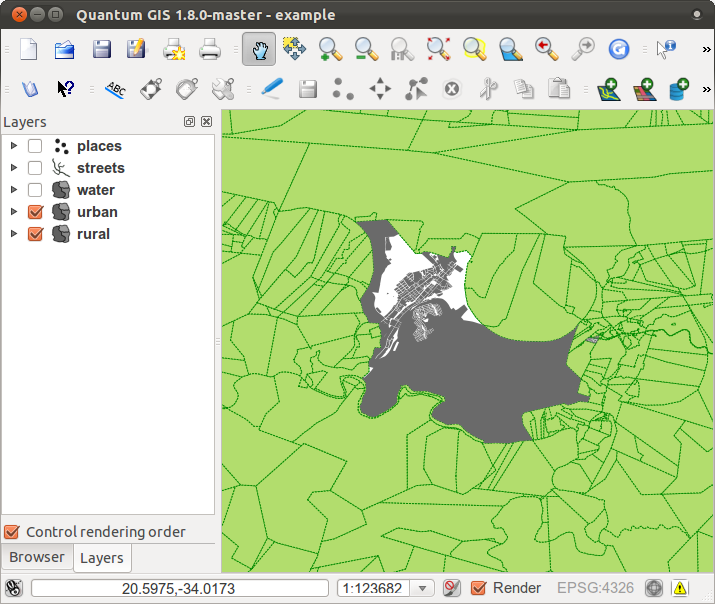

Answer Sheet
===============================================================================

|RF| *Adding Your First Layer*
-------------------------------------------------------------------------------

.. _interface-preparation-1:

|basic| *Preparation* exercise
...............................................................................

You should see a lot of lines, symbolizing roads. All these lines are in the
vector layer that you just loaded to create a basic map.

:ref:`Back to text <backlink-interface-preparation-1>`

|RF| *An Overview of the Interface*
-------------------------------------------------------------------------------

.. _interface-overview-1:

|basic| *Overview* challenge 1
...............................................................................

Refer back to the image showing the interface layout and check that you
remember the names and functions of the screen elements.

:ref:`Back to text <backlink-interface-overview-1>`

.. _interface-overview-2:

|basic| *Overview* challenge 2
...............................................................................

#. :guilabel:`Save as`
#. :guilabel:`Zoom to layer`
#. :guilabel:`Help`
#. :guilabel:`Rendering on/off`
#. :guilabel:`Measure line`

:ref:`Back to text <backlink-interface-overview-2>`

|RF| *Working with Vector Data*
-------------------------------------------------------------------------------

.. _vector-load-shapefiles-1:

|basic| *Shapefiles* challenge
...............................................................................

There should be two layers on your map: :guilabel:`places` and
:guilabel:`streets`.

:ref:`Back to text <backlink-vector-load-shapefiles-1>`

.. _vector-load-from-database-1:

|basic| *Databases* challenge
...............................................................................

All the vector layers should be loaded into the map. It probably won't look
nice yet:

.. image:: ../_static/vector/001.png

(We'll fix the ugly colors later.)

:ref:`Back to text <backlink-vector-load-from-database-1>`

|RF| *Symbology*
-------------------------------------------------------------------------------

.. _symbology-colors-1:

|basic| *Colors* challenge
...............................................................................

Verify that the colors are changing as you expect them to change. It is enough
to change only the :guilabel:`rural` layer for now. An example is below, but
may look different depending on the color you chose.

.. image:: ../_static/symbology/018.png

.. note:: If you want to work on only one layer at a time and don't want the
   other layers to distract you, you can hide a layer by clicking in the check
   box next to its name in the Layers list. If the box is blank, then the layer
   is hidden.

:ref:`Back to text <backlink-symbology-colors-1>`

.. _symbology-structure-1:

|basic| *Symbol Structure* challenge
...............................................................................

Seen together, your rural and urban layers should look more or less like this:

If you are a Beginner-level user, you may stop here. Use the method above to
change the colors and styles for all the remaining layers. Try using natural
colors for the objects. For example, a road should not be red or blue, but can
be gray or black.

Also feel free to experiment with different :guilabel:`Fill Style` and
:guilabel:`Border Style` settings for the polygons.

:ref:`Back to text <backlink-symbology-structure-1>`

.. _symbology-layers-1:

|moderate| *Symbol Layers* challenge
...............................................................................

Customize your layers as you like, but remember that it has to be easy to tell
different layers apart on the map.

Here's an example:

.. image:: ../_static/symbology/013.png

:ref:`Back to text <backlink-symbology-layers-1>`

.. _symbology-levels-1:

|moderate| *Symbol Levels* challenge
...............................................................................

To make the required symbol, you need at least three symbol layers:

.. image:: ../_static/symbology/021.png

The lowest symbol layer is a broad, solid yellow line. On top of it there is a
slightly thinner solid dark gray or black line. The symbol layer on top is a
thin white dashed line.

If your symbol layers resemble the above but you're not getting the result you
want, check that your symbol levels look something like this:

.. image:: ../_static/symbology/022.png

Now your symbol should look like this:

.. image:: ../_static/symbology/023.png

Which, on the map, gives you this kind of effect:

.. image:: ../_static/symbology/024.png

:ref:`Back to text <backlink-symbology-levels-1>`

.. _symbology-levels-2:

|hard| *Symbol Levels* challenge
...............................................................................

Adjust your symbol levels to these values:

.. image:: ../_static/symbology/026.png

Experiment with different values to get different results.

Open your original map again before continuing with the next exercise.

:ref:`Back to text <backlink-symbology-levels-2>`

|RF| *Attribute Data*
-------------------------------------------------------------------------------

.. _labels-attribute-data-1:

|basic| *Attribute Data* challenge
...............................................................................

The *NAME* field is the most useful to show as labels. This is because all its
values are unique for every object, and it contains no "null" values (i.e.,
fields with no value).

:ref:`Back to text <backlink-labels-attribute-data-1>`
