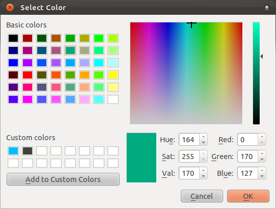
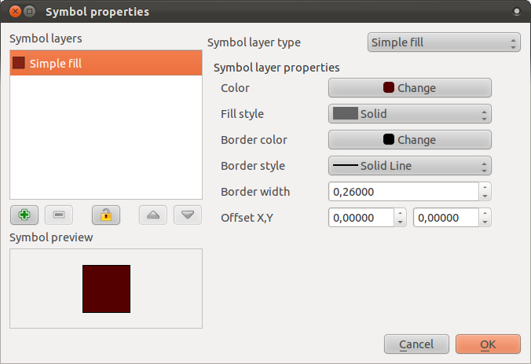

|L2| Symbology
===============================================================================

The symbology of a layer is its visual appearance on the map.
The basic strength of GIS over other ways of representing data with spatial
aspects is that with GIS, you have a dynamic visual representation of the data
you're working with.

Therefore, the visual appearance of the map (which depends on the symbology of
the individual layers) is very important. The end user of the maps you produce
will need to be able to easily see what the map represents. Equally as
important, you need to be able to explore the data as you're working with it,
and good symbology helps a lot.

In other words, having proper symbology is not a luxury or just nice to have.
In fact, it's essential for you to use a GIS properly and produce maps and
information that people will be able to use.

**The goal for this lesson:** To be able to create any symbology you want for
any vector layer.

|basic| |L3| Exercise: Changing colors
-------------------------------------------------------------------------------

Using the random palette automatically assigned when loading
the layers, your current map is probably not easy to read. It would be
preferable to assign your own choice of colors and symbols.

To change a layer's symbology, open its :guilabel:`Layer Properties`. This is
done by right-clicking on the layer in the Layers list, and then selecting the
menu item :guilabel:`Properties` in the menu that appears. Let's begin by
changing the color of the :guilabel:`urban` layer.

.. note:: You can also access a layer's properties by double-clicking on the
   layer in the Layers list.

In the :guilabel:`Properties` window, select the :guilabel:`Style` tab at the
extreme left:

.. image:: ../_static/symbology/004-diagram.png

Click the :guilabel:`Change` button next to the :guilabel:`Color` label
(outlined in orange above).  A standard color dialog will appear:

Choose a gray color and click :guilabel:`OK`. Click :guilabel:`OK` again in the
:guilabel:`Layer Properties` window, and you will see the color change being
applied to the layer.

.. image:: ../_static/symbology/019.png

|basic| |L3| Challenge
-------------------------------------------------------------------------------

Change the :guilabel:`rural` layer to a new color that you associate with rural
farming areas.

:ref:`Check your results <symbology-colors-1>`

|basic| |L3| Exercise: Changing symbol structure
-------------------------------------------------------------------------------

This is good stuff so far, but there's more to a layer's
symbology than just its color. Next we want to change the color of the farms
(the :guilabel:`rural` layer), but we also want to eliminate the lines between
the different farms so as to make the map less visually cluttered.

First, open the :guilabel:`Layer Properties` window for the :guilabel:`rural`
layer. Under the :guilabel:`Style` tab, you will see the same kind of dialog as
before. This time, however, you're doing more than just quickly changing the
color. So click on the :guilabel:`Change...` button below the color display,
outlined in the image below:

.. image:: ../_static/symbology/006-diagram.png

This dialog will appear:

First, change the color inside the polygons in the layer by clicking the button
next to the :guilabel:`Color` label (if you haven't done so already during the
previous lesson). In the dialog that appears, choose a new color (that seems to
suit a farm) and click :guilabel:`OK`, but only once.

Next, we want to get rid of the lines between all the farms. To do this, click
on the :guilabel:`Border style` dropdown. At the moment, it should be showing a
short line and the words :guilabel:`Solid Line`. Change this to :guilabel:`No
Pen`. Then click :guilabel:`OK`, and then :guilabel:`OK` again. Now the
:guilabel:`rural` layer should not have any lines!

|basic| |L3| Challenge
-------------------------------------------------------------------------------

First change the :guilabel:`urban` layer's symbology so that it is orange and
without outlines. (Orange is a color often used to denote human habitation.)

Next, change the :guilabel:`rural` layer again so that it has dotted outlines
which are just a bit darker than the fill color for that layer.

:ref:`Check your results <symbology-structure-1>`

|moderate| |L3| Exercise: Adding symbol layers
-------------------------------------------------------------------------------

Now that you know how to change simple symbology for layers,
the next step is to create more complex symbology. QGIS allows you to do this
using symbol layers.

.. note:: Users learing basic-level functions don't need to do this exercise,
   but it may be interesting to watch how it's done. This will give you an idea
   of the possibilities. You can also try to do this exercise if you like, but
   it's not necessary if you don't want to.

Go back to the :guilabel:`Symbol properties` dialog as before. In this example,
the current symbol has no outline (i.e., it uses the :guilabel:`No Pen` border
style).

.. image:: ../_static/symbology/009-diagram.png

Note the highlighted button. Clicking on it should do something like this:

.. image:: ../_static/symbology/010.png

Now there's a second symbol layer. Being a solid color, it will of course
completely hide the previous kind of symbol. Plus, it has a :guilabel:`Solid
Line` border style, which we don't want. Clearly this symbol has to be changed.

.. note:: It's important not to get confused between a map layer and a symbol
   layer. A map layer is a vector (or raster) that has been loaded into the
   map. A symbol layer is part of the symbol used to represent a map layer.
   This course will usually refer to a map layer as just a layer, but a symbol
   layer will always be called a symbol layer, to prevent confusion.

First, set the border style to :guilabel:`No Pen`, as before.

Next, change the fill style to something other than :guilabel:`Solid` or
:guilabel:`No brush`. For example:

.. image:: ../_static/symbology/011.png

Click :guilabel:`OK` in this dialog and :guilabel:`Apply` in the one after
that. Now you can see your results and tweak them as needed.

You can even add multiple extra symbol layers and create a kind of texture for
your layer that way.

.. image:: ../_static/symbology/012.png

It's fun! But it probably has too many colors to use in a real map...

|moderate| |L3| Challenge
-------------------------------------------------------------------------------

Create a simple, but not distracting texture for the :guilabel:`rural` layer
using the methods above.

:ref:`Check your results <symbology-layers-1>`

|moderate| |L3| Exercise: Enabling symbol levels
-------------------------------------------------------------------------------

When symbol layers are rendered, they are also rendered in a
sequence, similar to how the different map layers are rendered. This means that
in some cases, having many symbol layers in one symbol can cause unexpected
results.

If you haven't done so already, try giving the :guilabel:`streets` layer an
extra symbol layer. Give the base line a thickness of 2, and then add another
symbol layer on top of it with a thickness of 0.5.

You'll notice that this happens:

.. image:: ../_static/symbology/014.png

Well that's not what we want at all!

To prevent this from happening, you can enable symbol levels, which will
control the order in which the different symbol layers are rendered. In the
:guilabel:`Layer Properties` dialog, click on this button:

.. image:: ../_static/symbology/015-diagram.png

The :guilabel:`Symbol Levels` dialog will appear. Alter its values to match
this example:

.. image:: ../_static/symbology/016.png

Click :guilabel:`OK`, then :guilabel:`OK` again.

If all goes well, the map will now look like this:

.. image:: ../_static/symbology/017.png

|moderate| |L3| Challenge
-------------------------------------------------------------------------------

Change the appearance of the :guilabel:`streets` layer again.  The roads must
be dark gray or black, with a thin yellow outline, and a dashed white line
running in the middle to make them resemble a real road.

:ref:`Check your results <symbology-levels-1>`
