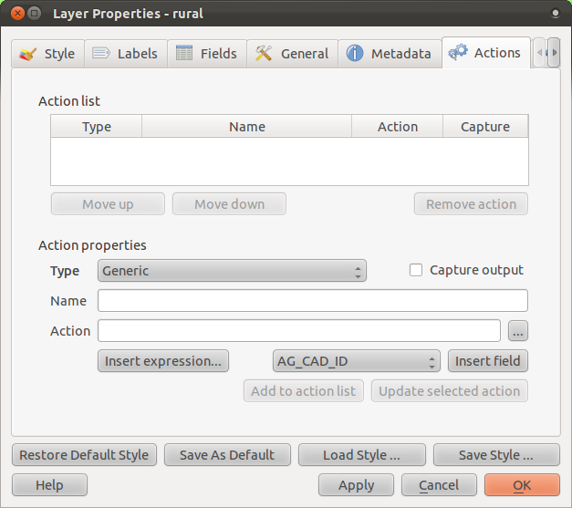

|LS| Actions
===============================================================================

Now that you've seen a default action in the previous lesson, it's time to
define your own actions. An action is something that happens when you click on
a feature. It can add a lot of extra functionality to your map, allowing you to
retrieve additional information about an object, for example. Assigning actions
can add a whole new dimension to your map!

**The goal for this lesson:** To learn how to add custom actions.

|basic| |FA| The Actions Tab
-------------------------------------------------------------------------------

Open the :guilabel:`Layer Properties` dialog for the :guilabel:`rural` layer as
always. Click on the :guilabel:`Actions` tab to see this interface:

Seems intimidating! But it doesn't need to be. Let's see how it works by adding
a new action.

|basic| |FA| Open an Image
-------------------------------------------------------------------------------

Use the :guilabel:`school_property` layer you created previously. The course
materials include photos of each of the three properties you digitized. What
we're going to do next is to associate each property with its image. Then we'll
create an action that will open the image for a property when clicking on the
property.

|basic| |FA| Add a Field for Images
-------------------------------------------------------------------------------

The :guilabel:`school_property` layer has no way to associate an image with a
property yet. First we'll create a field for this purpose. Open the
:guilabel:`Layer Properties` dialog and click on the :guilabel:`Fields` tab.
Toggle editing mode:

.. image:: ../_static/create_vector_data/037.png

Then add a new column:

.. image:: ../_static/create_vector_data/038.png

Enter the values below:

.. image:: ../_static/create_vector_data/039.png

After the field has been created, click on the :guilabel:`Line edit` button
next to the new field. Set it up for a :guilabel:`File name`:

.. image:: ../_static/create_vector_data/040.png

Click :guilabel:`OK` on the :guilabel:`Layer Properties` dialog. Then use the
:guilabel:`Identify` tool to click on one of the three features in the
:guilabel:`school_property` layer. Since you're still in edit mode, the dialog
should be active and look like this:

.. image:: ../_static/create_vector_data/041.png

Click on the browse button (the :guilabel:`...` next to the :guilabel:`image`
field) and select the path for your image. The images are in :kbd:`PATH` and
are named the same as the features they should be associated with. Once you're
done, click :guilabel:`OK`.

Associate all of the images with the correct features using this method. Then
save your edits and exit edit mode. Refer back to where you learned about these
buttons if you can't remember how to do that.

|basic| |FA| Creating an Action
-------------------------------------------------------------------------------

Open the :guilabel:`Actions` form for the :guilabel:`school_property` layer, as
explained above for the :guilabel:`rural` layer. Enter the words :kbd:`Show
Image` into the :guilabel:`Name` field:

.. image:: ../_static/create_vector_data/042.png

What to do next varies according to your operating system, so choose the
appropriate course to follow:

Windows
...............................................................................

Click on the :guilabel:`Type` dropdown and choose :guilabel:`Windows`.

Ubuntu Linux
...............................................................................

Under :guilabel:`Action`, write :kbd:`eog` for the *Gnome Image Viewer*, or
write :kbd:`display` to use *ImageMagick*. Remember to put a space after the
command!

MacOS
...............................................................................

Click on the :guilabel:`Type` dropdown and choose :guilabel:`Mac`. Under
:guilabel:`Action`, write :kbd:`open`. Remember to put a space after the
command!

Continue writing the command
...............................................................................

The next part is easy! You want to open the image, and QGIS knows where the
image is. All it needs to do is to tell the :guilabel:`Action` where the image
is. Select :guilabel:`image` from the list:

.. image:: ../_static/create_vector_data/043.png

Then click the :guilabel:`Insert field` button. QGIS will add the phrase
:kbd:`[% "image" %]` in the :guilabel:`Action` field.

That's all you need! Now click the :guilabel:`Add to action list` button and
you're done creating the action! Click :guilabel:`OK` on the :guilabel:`Layer
Properties` dialog.

Now to test the new action! With the :guilabel:`school_property` layer active
in the :guilabel:`Layers list`, find the :guilabel:`Run feature action` button
(on the same toolbar as the :guilabel:`Open Attribute Table` button):

.. image:: ../_static/create_vector_data/036.png

Click on the down arrow to the right of this button. There's only one action
defined for this layer so far, which is the one you just created. Now click the
button itself to activate the tool. Using this tool, click on any of the three
school properties. The image for that property will now open. Congratulations!

|moderate| |FA| Searching the Internet
-------------------------------------------------------------------------------

Let's say we're looking at the map and want to know more about the area that a
farm is in. Suppose you know nothing of the area in question and want to find
general information about it. Your first impulse, considering that you're using
a computer right now, would probably be to Google the name of the area. So
let's tell QGIS to do that automatically for us!

First, open the attribute table for the :guilabel:`rural` layer (you may need
to close :guilabel:`Layer Properties` first). There are several fields with
names of the area that the farms are in, but many of them contain some rather
strange names. The one field that contains names that are easy to search for on
Google is the :guilabel:`SGADMIN` field. So we'll be using that field for our
searches.

Close the attribute table and go back to :guilabel:`Actions` in
:guilabel:`Layer Properties`. In the field :menuselection:`Action Properties
--> Name`, write :kbd:`Google Search`. What to do next varies according to your
operating system, so choose the appropriate course to follow:

Windows
...............................................................................

Under :guilabel:`Action`, write :kbd:`start`. This will tell Windows to open
an Internet address with Internet Explorer.

Ubuntu Linux
...............................................................................

Under :guilabel:`Action`, write :kbd:`xdg-open`. This will tell Ubuntu to open
an Internet address in your default browser, such as Chrome or
Firefox.

MacOS
...............................................................................

Under :guilabel:`Action`, write :kbd:`open`. This will tell MacOS to open an
Internet address in your default browser, such as Safari.

Continue writing the command
...............................................................................

Whichever command you used above, you need to tell it which Internet address to
open next. You want it to visit Google, and to search for a phrase
automatically.

Usually when you use Google, you enter your search phrase into the Google
Search bar. But in this case, you want your computer to do this for you. The
way you tell Google to search for something (if you don't want to use its
search bar directly) is by giving your Internet browser the address
:kbd:`http://www.google.co.za/search?q=PHRASE`, where :kbd:`PHRASE` is the word
you want to search for. Since we don't know what phrase to search for yet, just
enter the first part (without the phrase):
:kbd:`http://www.google.co.za/search?q=`. Remember to add a space after your
initial command before writing this in!

Now you want QGIS to tell the browser to tell Google to search for the value of
:kbd:`SGADMIN` for any feature that you could click on. Complicated!

Select the :guilabel:`SGADMIN` field and click :guilabel:`Insert field`:

.. image:: ../_static/create_vector_data/034.png

This will tell QGIS to add the phrase next:

.. image:: ../_static/create_vector_data/035.png

What this means is that QGIS is going to open the browser and send it to the
address :kbd:`http://www.google.co.za/search?q=[% "SGADMIN" %]`. But :kbd:`[%
"SGADMIN" %]` is a direction to tell QGIS to use the contents of the
:kbd:`SGADMIN` field as the phrase to search for. So if, for example, the farm
you clicked on is in the :kbd:`Montagu` area, then QGIS is going to send the
browser to :kbd:`http://www.google.co.za/search?q=Montagu`, which will cause
the browser to visit Google, which will in turn search for the word "Montagu".

If you haven't done so already, set everything up as explained above, then
click the :guilabel:`Add to action list` button. The new action will appear in
the list above. Click :guilabel:`OK` on the :guilabel:`Layer Properties`
dialog.

Now to test the new action! With the :guilabel:`rural` layer active in the
:guilabel:`Layers list`, click on the :guilabel:`Run feature action` button as
before. Now click on any farm you can see on the map. Your browser will now
open, and will automatically start a Google search for the town that is
recorded as that farm's :kbd:`SGADMIN` value.

.. note:: If your action doesn't work, check that everything was entered
   correctly; typos are common with this kind of work! If you're sure
   everything is correct (and the problem isn't your internet connection), feel
   free to send an error report to the authors of this course. It may be that
   your OS doesn't understand the command QGIS is giving it. Since we can't
   test this ourselves in every OS ever made, your input would be appreciated!

|hard| |TY| Run Any Shell Command
-------------------------------------------------------------------------------

(Check if planned command is possible on Windows ...)
