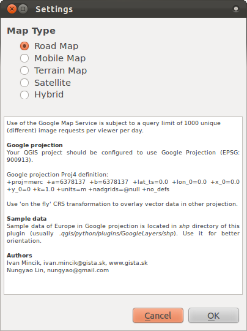
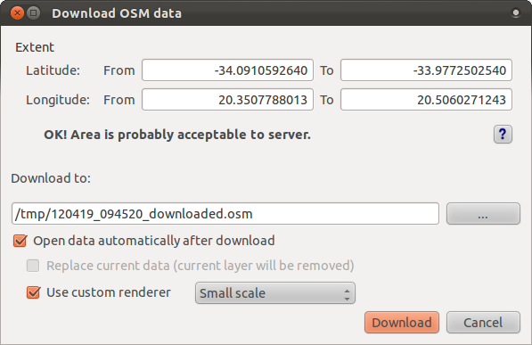
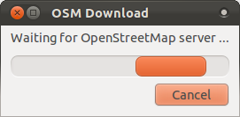

|LS| Useful QGIS Plugins
===============================================================================

Now you can install, enable and disable plugins. Let's see how this can help
you in practice by looking at some examples of useful plugins. 

**The goal for this lesson:** To familiarize yourself with the plugin interface
and get acquainted with some useful plugins.

|basic| |FA| The Google Layers Plugin
-------------------------------------------------------------------------------

Start a new map with only the :guilabel:`streets` layer in it, and zoom in over
the Swellendam area. Using the :guilabel:`Plugin Installer`, find the plugin by
entering the word :kbd:`Google` in the :guilabel:`Filter` field. Select the
Google Layers plugin from the filtered list:

.. image:: ../_static/qgis_plugins/020.png

Click the :guilabel:`Install plugin` button to install. When it's done, close
the :guilabel:`Plugin Installer` and open the :guilabel:`Plugin Manager`.
Enable the new plugin:

.. image:: ../_static/qgis_plugins/021.png

Check the box beside it and then click :guilabel:`OK` to enable the plugin.

Before using it, make sure that both your map and the plugin are configured
properly. First open the plugin's settings by clicking on
:menuselection:`Plugins --> Google Layers --> Settings`. You'll see this
dialog:

Use it to choose a map type you want. In this example, we'll use the "Hybrid"
type map, but you can choose any others if you want.

Enable "on the fly" projection and use the Google Mercator projection:

.. image:: ../_static/qgis_plugins/023.png

Now use the plugin to give you a Google map of the area! You can click on
:menuselection:`Plugins --> Google Layers --> Google Layers` to run it. Or, if
you have the :guilabel:`Plugins` toolbar enabled, you can click on its icon:

.. image:: ../_static/qgis_plugins/025.png

This will load a new raster image in from Google that you can use as a
backdrop, or to help you find out where you are on the map. Here is such a
layer, with our own vector road layer as overlay:

.. image:: ../_static/qgis_plugins/024.png

|moderate| |FA| The OpenStreetMap Plugin
-------------------------------------------------------------------------------

Since we're using OpenStreetMap (OSM) data in our examples, it would be
instructive to know where it comes from. QGIS has a plugin that allows you to
download and edit this kind of data easily.

First, ensure that you have the plugin installed by opening the
:guilabel:`Plugin Installer` and filtering on the word :kbd:`street`:

.. image:: ../_static/qgis_plugins/006.png

The :guilabel:`OpenStreetMap plugin` should be installed by default, but if it
isn't, you can get it by clicking the :guilabel:`Install plugin` button.

Once it's installed, activate it via the :guilabel:`Plugin Manager`. A new
panel and new buttons will be added to your interface:

.. image:: ../_static/qgis_plugins/007.png

Let's download data for Swellendam. The plugin will download data for the area
currently on your map, so zoom in to the Swellendam area first. Then, to add
data, click on the :guilabel:`Download OSM data` button:

.. image:: ../_static/qgis_plugins/008.png

You'll be shown this dialog:

Note that you may see a message stating that the latitude, longitude, or both
extents are too large. This is because the OSM server doesn't have the capacity
to continually give people data about the whole world. To prevent people trying
to download too much data, there's a limit to the size of the area for which
you can download data. If you get one of these error messages, zoom in to a
smaller area on the map.

If you have an acceptable area, you can leave the other options as default and
click the :guilabel:`Download` button.

You'll see a dialog like this:

After a while, the data will be downloaded, and will be shown in your map
automatically. Here's an example:

.. image:: ../_static/qgis_plugins/011.png

(The labels are added from our local data for identification purposes.)

With any of the OSM layers selected in your :guilabel:`Layers list`, the
buttons in the plugin's dock panel will become active:

.. image:: ../_static/qgis_plugins/012.png

Using the plugin's own :guilabel:`Identify feature` tool (at the far left of
the above buttons), you can click on any feature in the OSM layers to retrieve
its data and see it displayed in the plugin interface. For example, clicking on
the river that runs through town gives you this:

.. image:: ../_static/qgis_plugins/013.png

You can create new features (point, lines, polygons) as well as edit a feature
that you have identified. For example, using the plugin's :guilabel:`Identify
feature` tool as before, you can click on this street:

.. image:: ../_static/qgis_plugins/014.png

Looking at its attributes, it doesn't have a name:

.. image:: ../_static/qgis_plugins/015.png

Double-clicking in the :guilabel:`<new tag here>` field allows you to select a
new tag (attribute) from a list. Let's choose :guilabel:`name`:

.. image:: ../_static/qgis_plugins/016.png

Double-clicking in the :guilabel:`Value` field allows you to change the value:

.. image:: ../_static/qgis_plugins/017.png

You can save your changes to the original source data, too. This makes the
changes available internationally on the OSM server. Click the
:guilabel:`Upload OSM data` button:

.. image:: ../_static/qgis_plugins/018.png

This gives you a dialog, which you can fill in as needed. If you have a user
account at OSM, you can enter your credentials in the spaces provided and click
the :guilabel:`Upload` button to save those changes.

Note that the plugin has many other functions: for example, you can also save
OSM layers to a local directory, load data from saved OSM layers, and export
OSM data as shapefiles.

OSM's data comes from, and is maintained by, the efforts of their users.
Contributing data using this plugin allows you to help improve the quality of
the OSM data you depend on.

|IC|
-------------------------------------------------------------------------------

There are many useful plugins available for QGIS. Using the built-in tools for
installing and managing these plugins, you can find new plugins and make
optimum use of them.

|WN|
-------------------------------------------------------------------------------

Next we'll look at how to use layers that are hosted on remote servers in real
time.
