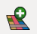
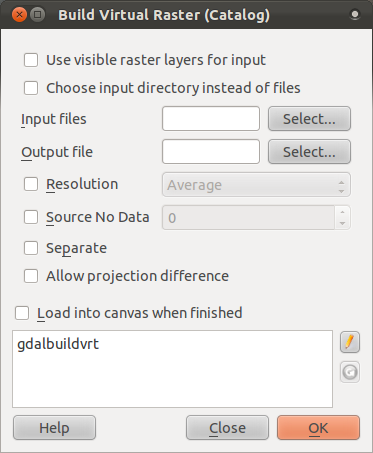
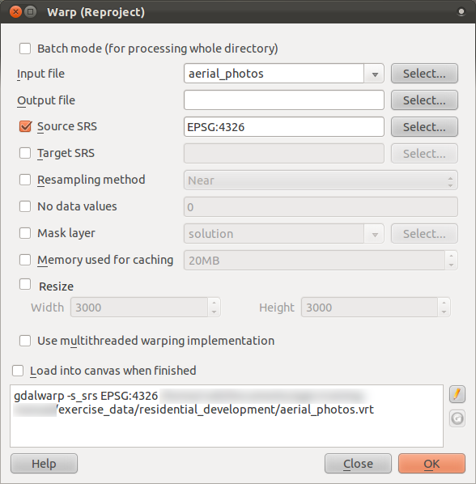
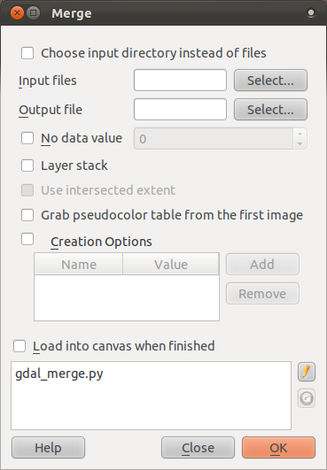

|LS| Working with Raster Data
===============================================================================

Raster data is quite different from vector data. Vector data has discrete
features constructed out of vertices, and perhaps connected with lines and/or
areas. Raster data, however, is like any image. Although it may portray various
properties of objects in the real world, these objects don't exist as separate
objects; rather, they are represented using pixels of various different color
values.

During this module you're going to use raster data to supplement your existing
GIS analysis.

**The goal for this lesson:** To learn how to work with raster data in the QGIS
environment.

|basic| |FA| Loading Raster Data
-------------------------------------------------------------------------------

Open your :kbd:`analysis.qgs` map. Deactivate all the layers except the
:guilabel:`solution` and :guilabel:`important_roads` layers.

Loading raster data is much the same as loading vector data. Find the
:guilabel:`Load Raster Layer` button:

Click on it to bring up the :guilabel:`Load Raster Layer` dialog:

.. image:: ../_static/rasters/002.png
   :align: center

The data for this project is in :kbd:`exercise_data/rasters`. Open all of the
files that end in :kbd:`.tif`. Either load them all in separately, or hold down
:kbd:`ctrl` and click on all four of them in turn, then open them at the same
time.

.. note:: |note| A file that ends in :kbd:`.tif.ovr` is an overview file. It is
   associated with the :kbd:`.tif` file of the same names, and allows it to
   render faster in QGIS. Don't try to open the :kbd:`.tif.ovr` files yourself;
   they will load automatically when you open their associated :kbd:`.tif`
   file.

The first thing you'll notice is that nothing seems to be happening in your
map. Are the rasters not loading? Well, there they are in the :guilabel:`Layers
list`, so obviously they did load. The problem is that they're not in the same
projection.

Luckily, we've already seen what to do in this situation. Click on the
:guilabel:`CRS Status` button:

.. image:: ../_static/rasters/003.png
   :align: center

Enable "on the fly" reprojection and set it to the same projection as the rest
of your data (:kbd:`WGS 84 / UTM zone 33S`). Click :guilabel:`OK` and the
rasters should fit nicely:

.. image:: ../_static/rasters/004.png
   :align: center

There we have it - four aerial photographs covering our whole study area.

|basic| |FA| Create a Virtual Raster
-------------------------------------------------------------------------------

Now as you can see from this, your solution layer lies across all four
photographs. What this means is that you're going to have to work with four
rasters all the time. That's not ideal; it would be better to have one file for
one (composite) image, right?

Luckily, QGIS allows you to do exactly this, and without needing to actually
create a new raster file, which could take up a lot of space. Instead, you can
create a *Virtual Raster*. This is also often called a *Catalog*, which
explains its function. It's not really a new raster. Rather, it's a way to
organize your existing rasters into one catalog: one file for easy access.

To make a catalog, go to :menuselection:`Raster --> Miscellaneous --> Build
Virtual Raster (Catalog)`. This dialog will appear:

Check the box next to :guilabel:`Use visible raster layers for input` so that
you don't need to specify which rasters to use again.

The output location should be the :kbd:`exercise_data/residential_development`,
and the file name :kbd:`aerial_photos.vrt`.

Lastly, check the :guilabel:`Load into canvas when finished` button.

Notice the text field below. What this dialog is actually doing is that it's
writing that text for you. It's a long command that QGIS is going to run.

.. note:: |note| |hard| Keep in mind that the command text is editable, so you can
   customize the command further if preferred. Search online for the initial
   command (in this case, :kbd:`gdalbuildvrt`) for help on the syntax.

Now click :guilabel:`OK` to run the command.

It may take a while to complete. When it's done, it will tell you so with a
message box. Click :guilabel:`OK` to chase the message away, then click
:guilabel:`Close` on the :guilabel:`Build Virtual Raster (Catalog)` dialog.
(Don't click :guilabel:`OK` again, otherwise it's going to start running that
command again!)

You can now remove the original four rasters from the :guilabel:`Layers list`.
If necessary, click and drag the new :guilabel:`aerial_photos` raster catalog
layer to the bottom of the :guilabel:`Layers list` so that the other activated
layers become visible.

|hard| Transforming Raster Data
-------------------------------------------------------------------------------

The above methods allow you to virtually merge datasets using a catalog, and to
reproject them "on the fly". However, if you are setting up data that you'll be
using for quite a while, it may be more efficient to create new rasters that
are already merged and reprojected. This improves performance while using the
rasters in a map, but it may take some time to set up initially.

Reprojecting rasters
...............................................................................

To reproject a raster, go to :menuselection:`Raster --> Projection --> Warp
(Reproject)`. You'll see this dialog:

Note that it features a handy batch option for reprojecting the contents of
whole directories. You can also reproject virtual rasters (catalogs), as well
as enabling a multithreaded processing mode.

Merging rasters
...............................................................................

To merge rasters, go to :menuselection:`Raster --> Miscellaneous --> Merge`.
It will bring up this dialog:

You can choose to process entire directories instead of single files, giving
you a very useful built-in batch processing capability. You can specify a
virtual raster as input file, too, and all of the rasters that it consists of
will be processed.

You can also add your own command line options using the :guilabel:`Creation
Options` checkbox and list. This only applies if you have knowledge of the GDAL
library's operation.

|IC|
-------------------------------------------------------------------------------

QGIS makes it easy to include raster data into your existing projects.

|FR|
-------------------------------------------------------------------------------

|WN|
-------------------------------------------------------------------------------

Next, we'll use raster data that isn't aerial imagery, and see how
symbolization is useful in the case of rasters as well!
