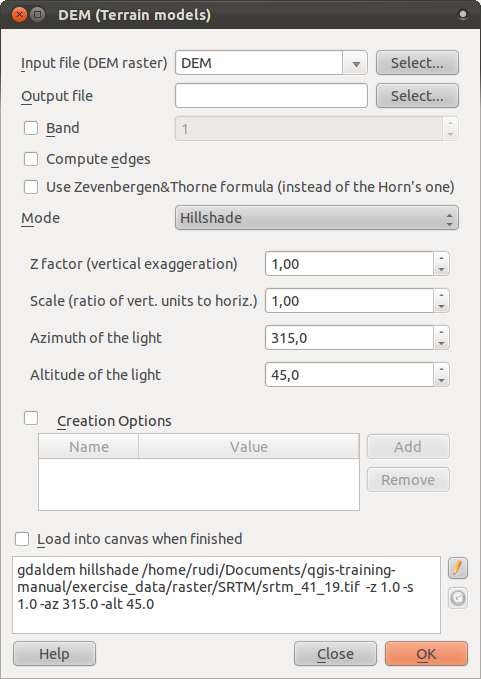
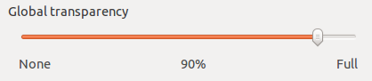
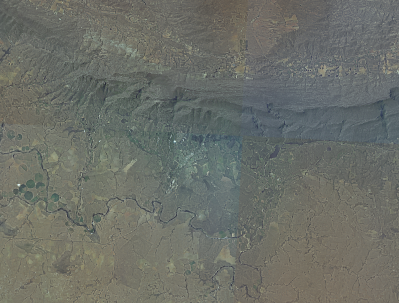

|LS| Terrain Analysis
===============================================================================

Certain types of rasters allow you to gain more insight into the terrain that
they represent. Digital Elevation Models (DEMs) are particularly useful in this
regard. In this lesson you will use terrain analysis tools to find out more
about the study area for the proposed residential development from earlier.

**The goal for this lesson:** To use terrain analysis tools for more
information on terrain.

|FA| |basic| Calculating a Hillshade
-------------------------------------------------------------------------------

The DEM you have on your map right now does show you the elevation of the
terrain, but it can sometimes seem a little abstract. It contains all the 3D
information about the terrain that you need, but it doesn't look like a 3D
object. To get a better look at the terrain, it is possible to calculate a
*hillshade*, which is a raster that maps the terrain using light and shadow to
create a 3D-looking image.

To work with DEMs, you should use QGIS' all-in-one :guilabel:`DEM (Terrain
models)` analysis tool. Go to :menuselection:`Raster --> Analysis --> DEM
(Terrain models)`. Clicking on this menu item will bring up the tool you need:

Ensure that the :guilabel:`Input file` is the :guilabel:`DEM` layer. Set the
:guilabel:`Output file` to :kbd:`hillshade.tif` in the directory
:kbd:`exercise_data/residential_development`. Check the box next to
:guilabel:`Load into canvas when finished`.

You may leave all the other options unchanged. Click :guilabel:`OK` to generate
the hillshade. When it tells you that processing is completed, click
:guilabel:`OK` on the message to get rd of it, then click :guilabel:`Close` on
the main :guilabel:`DEM (Terrain models)` dialog.

You will now have a new layer called :guilabel:`hillshade` that looks like
this:

.. image:: ../_static/rasters/020.png

That looks nice and 3D, but can we improve on this? On its own, the hillshade
looks like a plaster cast. Can't we use it together with our other, more
colorful rasters somehow? Of course we can, by using the hillshade as an
overlay.

|FA| |basic| Using a Hillshade as an Overlay
-------------------------------------------------------------------------------

A hillshade can provide very useful information about the sunlight at a given
time of day. But it can also be used for aesthetic purposes, to make the map
look better. The key to this is setting the hillshade to being mostly
transparent.

First, hide all the layers except the :guilabel:`aerial_photos` layer. Click
and drag it to be beneath the :guilabel:`hillshade` layer in the
:guilabel:`Layers list`. :guilabel:`Control rendering order` (beneath the list)
should be checked as well.

Now set the :guilabel:`hillshade` layer to be transparent. Open its
:guilabel:`Layer Properties` and go to the :guilabel:`Transparency` tab. Set
the :guilabel:`Global transparency` to :kbd:`90%`:

Now click :guilabel:`OK` on the :guilabel:`Layer Properties` dialog. You'll get
a result like this:

Switch the :guilabel:`hillshade` layer off and back on in the :guilabel:`Layers
list` to see the difference it makes. Using a hillshade in this way, it's
possible to enhance the topography of the landscape, if the light is coming
from more or less the same angle. If the effect doesn't seem strong enough to
you, you can set the transparency of the :guilabel:`hillshade` layer to a lower
value; but of course, the brighter the hillshade becomes, the dimmer the photo
behind it will be. You will need to find a balance that works for you.

It's also possible to create a nice effect by using the :guilabel:`DEM` layer
instead of the :guilabel:`aerial_photos` layer. Move the :guilabel:`DEM` to be
below the :guilabel:`aerial_photos`, then set the symbology of the
:guilabel:`DEM` to use :guilabel:`Pseudocolor`. Make the :guilabel:`hillshade`
layer more visible by setting its :guilabel:`Global transparency` to
:kbd:`50%`. If you now hide the :guilabel:`aerial_photos` layer and make the
:guilabel:`DEM` visible, you'll get this:

.. image:: ../_static/rasters/023.png

You can decide which of these two settings you'd prefer to use.

|FA| |intermediate| Calculating the Slope
-------------------------------------------------------------------------------

Another useful thing to know about the terrain is how steep it is. If, as in
our analysis, you want to build houses on the land there, then you need land
that is relatively flat. 
