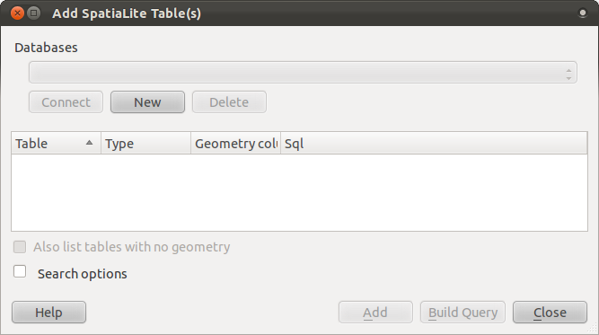

Databases
=========

Databases allow you to store a large volume of associated data in one file. You
may already be familiar with database management systems (DBMS) such as
Microsoft Access. GIS applications can also make use of databases. GIS-specific
databases have extra functions, because they need to handle spatial data.

Exercise: Loading vector data from a database
---------------------------------------------

Find this icon in QGIS:

.. image:: ../_static/vector/005.png

Clicking it will give you this dialog:

In this dialog, click the :guilabel:`New` button. In the same folder as the
other data, you should find the file :guilabel:`land_use.db`. Select it and
click :guilabel:`Open`.

You will now see the first dialog again. Notice that the dropdown select above
the three buttons now reads "land_use.db@...", followed by the path of the
database file on your computer. Click the :guilabel:`Connect` button. You
should see this in the previously empty box:

.. image:: ../_static/vector/007.png

Click on the first layer to select it, then use :kbd:`shift+click` to select
all of them at once.

Click :guilabel:`Add`. This will add all three layers to the map at once.

Remember to save the map often!

Check your results
..................

All the vector layers should be loaded into the map. It probably won't look
nice yet:

.. image:: ../_static/vector/001.png

(We'll fix the ugly colors later.)
