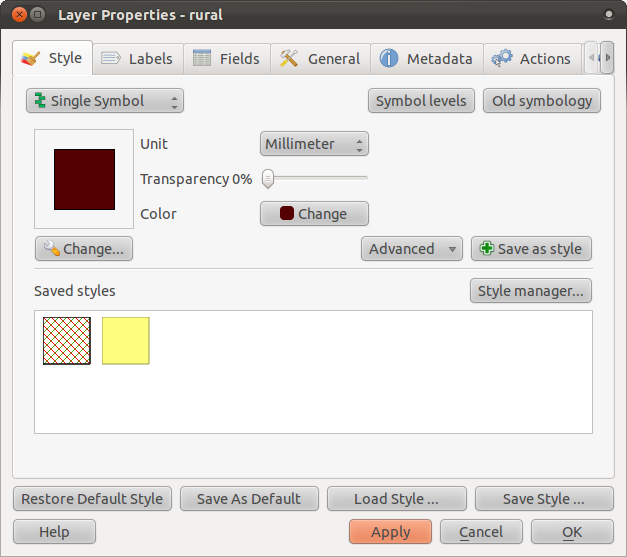

Spatial and Attribute Data
==========================

It's important to know that the data you will be working with does not only
represent where objects are in space, but also tells you what those objects
are.

From the previous exercise, you should have the :guilabel:`streets` layer
loaded in your map. What you can see right now is merely the position of the
roads.

Exercise: Viewing layer attributes
----------------------------------

To see all the data available to you, find this button in QGIS:

Clicking it will show you a table with more data about the :guilabel:`streets`
layer. This extra data is called *attribute data*. The lines that you can see
on your map represent where the streets go; this is the *spatial data*.

These definitions are commonly used in GIS, so it's essential to remember them!
(You may now close the attribute table.)
