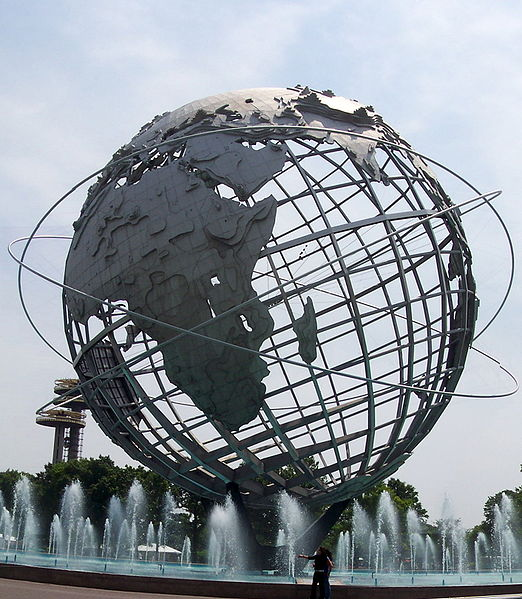

|LS| Reprojecting and Transforming Data
===============================================================================

Let's talk about Coordinate Reference Systems (CRSs) again. We've touched on
this briefly before, but haven't discussed what it means practically.

**The goal for this lesson:** To reproject and transform vector datasets.

|basic| |FA|
-------------------------------------------------------------------------------

The CRS that all the data as well as the map itself are in right now is called
WGS84. This is a very common Geographic Coordinate System (GCS) for
representing data. But there's a problem, as we will see.

Try setting a scale in the :guilabel:`Scale` field, which is in the
:guilabel:`Status Bar` along the bottom of the screen. While over Swellendam,
set this value to 1:100000. Now pan around the map while keeping an eye on the
:guilabel:`Scale` field. Notice the scale changing? That's because you're
moving away from the one point that you zoomed into at 1:100000, which was at
the center of your screen. All around that point, the scale is different.

Think about a globe of the Earth. It probably has lines running along it from
North to South. These longitude lines are far apart at the equator, but they
meet at the poles.

In a GCS, these lines stay equally far apart from each other, even at the
poles. This means that, as you travel away from the equator on your map, the
scale of the objects that you see gets larger and larger. What this means for
us, practically, is that there is no constant scale on our map!

To solve this, let's use a Projected Coordinate System (PCS) instead. A PCS
projects the data in a way that makes allowance for the scale change and
eliminates it. Therefore, to keep the scale constant, we should reproject our
data to use a PCS.

The one we're going to use for this is calle :kbd:`UTM 33S`. UTM stands for
Universal Transverse Mercator, and is used to represent features that are at
a longitude of 33 degrees, and are South of the equator.

(To be continued)
