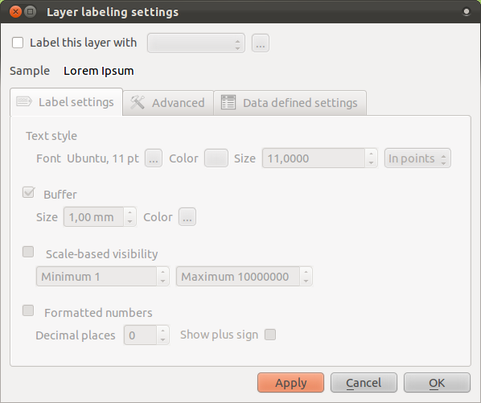

|LS| The Label Tool
===============================================================================

Labels can be added to a map to show any information about an object. Any
vector layer can have labels associated with it. These labels rely on the
attribute data of a layer for their content.

The :guilabel:`Layer Properties` dialog does have a :guilabel:`Labels` tag, but
for this example we will not be using it. Instead, we'll use the separate
:guilabel:`Label tool`, which has more options.

**The goal for this lesson:** To apply useful and good-looking labels to a
layer.

|FA| Using labels
-------------------------------------------------------------------------------

Before being able to access the Label tool, you will need to ensure that it has
been activated. First, go to the menu item :menuselection:`View --> Toolbars`,
and ensure that the :guilabel:`Label` item has a check mark next to it. If it
doesn't, click on the :guilabel:`Label` item, and it will be activated.

Once it has been activated (or if it already had a check mark), click on the
:guilabel:`places` layer in the :guilabel:`Layers list`, so that it is
highlighted. Then look for the following toolbar button:

.. image:: ../_static/labels/001.png

This should give you the following dialog:

Checking the box next to :guilabel:`Label this layer with...` will result in
this:

.. image:: ../_static/labels/003.png

You'll need to choose which field in the attributes will be used for the
labels. Previously, you decided it would be the *NAME* field. Select
:guilabel:`NAME` from the list:

.. image:: ../_static/labels/004.png

... and click :guilabel:`OK`. The map should now have labels like this:

.. image:: ../_static/labels/005.png

[lesson still being written]
